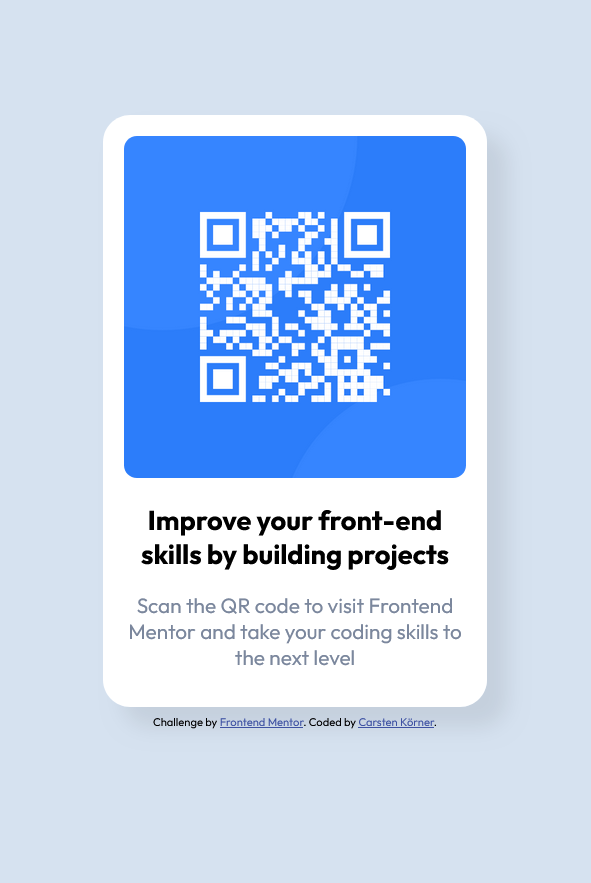

# Frontend Mentor - QR code component solution

This is a solution to the [QR code component challenge on Frontend Mentor](https://www.frontendmentor.io/challenges/qr-code-component-iux_sIO_H). Frontend Mentor challenges help you improve your coding skills by building realistic projects. 

### Screenshot

### Links

- Solution URL: [Add solution URL here](https://your-solution-url.com)
- Live Site URL: [Add live site URL here](https://your-live-site-url.com)

### Built with

- HTML
- CSS 
- BEM - Even if it wasn't necessary here, I now always use it so that it becomes a standard for me.
- Flexbox

### What I learned

First time I used HSL Colors and CSS Variables.

### Continued development

- Using variables
- Flexbox & Grid
- Using BEM
- Responsive design

## Author

- Carsten Körner
- Frontend Mentor - [@carstenkoerner](https://www.frontendmentor.io/profile/carstenkoerner)